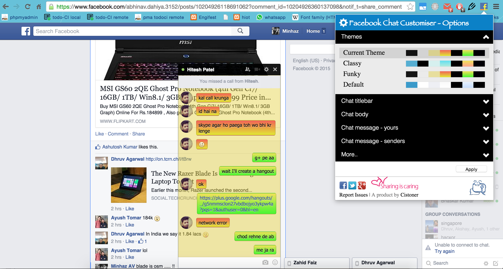

facebook-chat-customiser
========================
###About
 - `Description:` Chrome extension to customise Facebook's chat interface!
 - `Short Name:` `fcc`
 - `Version:` 3.6.0
 - `Installation Link:` [Chrome Store](https://chrome.google.com/webstore/detail/facebook-chat-customiser/cfdnmijlibfnjggfeipmjhkbieegjhbd)
 - `Project Page:` [Cistoner / fcc](http://cistoner.org/projects/facebook-chat-customiser/)

###Testing development version
You can test the fcc currently in development and post bugs / feature requests for a better and bug free customiser. Here's steps to do so:
 - Clone this repo or download as zip and unzip it.
 - Open `chrome://extensions/` on google chrome, check (select) developer mode
 - `Load Unpacked Extensions` > select the folder
 - Test and tell us how you feel

P.S: after downloading / cloning you can delete `screenshots/` directory in the root folder!

###Current Features:
 - Modify Chatbox's height, color, transparency!
 - Modify Text color, font!
 - Change these directly from the facebook menu!

###Screenshots


###Contributors
**A V Minhaz** - `minhazav@gmail.com`

[](https://github.com/mebjas)
[](http://in.linkedin.com/in/minhazav)
[](https://twitter.com/minhazav)
###License
```
Copyright [2013-14] A V Minhaz <minhazav@gmail.com>
```


